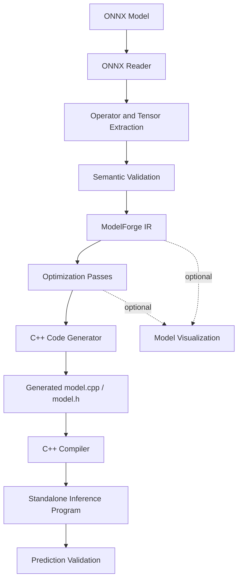

# ModelForge
## A Lightweight ONNX-to-C++ Compiler for Standalone Neural Network Inference

> **Compiler Design Laboratory — Individual Project**  
> **Implementation Language:** C++17  
> **Input:** ONNX model (`.onnx`)  
> **Output:** Standalone C++ inference code (`.cpp` / `.h`)  
> **Core Idea:** Parse an ONNX model, validate it, lower it into a simplified intermediate representation, apply compiler-style optimizations, generate C++ inference code, and verify that the generated program preserves the original model's output.

---

## 1. Abstract

Modern machine-learning models are commonly stored in portable formats such as ONNX and executed using large inference runtimes. For small neural networks, however, depending on a complete runtime can be unnecessary.

**ModelForge** is a lightweight educational ML compiler that converts a supported subset of ONNX neural-network models into standalone C++ inference code.

The system reads an ONNX model, validates supported operators and tensor properties, converts the model into a simplified internal intermediate representation (IR), applies compiler optimization passes, and finally generates equivalent C++ code.

The generated C++ program can be compiled independently and used to perform inference without requiring the original high-level machine-learning framework.

ModelForge also validates correctness by comparing the predictions of the original ONNX model with those of the generated C++ implementation.

A model visualization may be provided as a supporting feature to make the compilation process easier to understand, but visualization is **not the core purpose of the project**.

---

# 2. Problem Statement

Machine-learning models are frequently developed using frameworks such as PyTorch, TensorFlow, or scikit-learn and exported to ONNX for portability.

Running an ONNX model normally requires an inference runtime. For small neural networks, this introduces additional runtime dependencies and hides many of the compilation steps involved in converting model operations into executable computations.

The problem addressed by ModelForge is:

> **How can a small ONNX neural-network model be translated into understandable and standalone C++ inference code while demonstrating compiler-design concepts such as intermediate representation, semantic validation, optimization, and target-code generation?**

---

# 3. Motivation

Traditional compiler-design projects often implement small arithmetic languages or simplified C compilers.

ModelForge applies the same compiler principles to **machine-learning models**.

Instead of:

```text
Source Code
    ↓
Parser
    ↓
Intermediate Representation
    ↓
Optimization
    ↓
Target Code
```

ModelForge performs:

```text
ONNX Model
    ↓
ONNX Reader
    ↓
Model Validation
    ↓
ModelForge IR
    ↓
Optimization
    ↓
C++ Code Generation
    ↓
Standalone Inference Program
```

This creates a project that combines:

- Compiler Design
- Machine Learning
- C++
- Intermediate Representations
- Code Optimization
- Code Generation
- Static Validation
- Runtime Verification

---

# 4. Objectives

The main objectives of ModelForge are:

1. Read a neural-network model stored in ONNX format.
2. Extract supported model operators, tensors, parameters, and metadata.
3. Validate tensor datatypes, dimensions, and supported operations.
4. Convert ONNX operations into a simplified internal representation.
5. Apply simple compiler optimization passes.
6. Generate readable standalone C++ inference code.
7. Compile and execute the generated C++ program.
8. Compare generated-model predictions with the original ONNX model.
9. Report compilation stages, optimizations, and validation results.
10. Optionally provide a simple model visualization for explanation and demonstration.

---

# 5. Scope

ModelForge is intentionally designed as a **small educational compiler**.

It will **not attempt to support the complete ONNX specification**.

## Initial supported operators

```text
Gemm
MatMul
Add
Relu
Sigmoid
Softmax
```

Possible later additions:

```text
Flatten
Tanh
Identity
```

## Supported models

The initial implementation will focus on small feed-forward neural networks such as:

- Iris classifier
- Small MLP classifiers
- Simple MNIST fully connected network

## Out of scope

The initial implementation will not support:

- CNN-heavy architectures
- YOLO
- ResNet
- Transformers
- Attention
- LSTM / GRU
- Dynamic control flow
- Arbitrary dynamic tensor shapes
- GPU code generation

---

# 6. Compiler Design Concepts Used

ModelForge focuses mainly on the **middle-end and back-end stages of compilation**.

## 6.1 Parsing / Model Loading

The compiler reads the serialized ONNX representation and extracts:

- Inputs
- Outputs
- Operators
- Initializers
- Weights
- Biases
- Tensor datatypes
- Tensor dimensions

---

## 6.2 Semantic Analysis

ModelForge performs model-specific semantic checks.

Examples:

### Unsupported operator

```text
COMPILATION ERROR

Unsupported operator:
Conv

Currently supported:
Gemm
MatMul
Add
Relu
Sigmoid
Softmax
```

### Shape mismatch

```text
SEMANTIC ERROR

MatMul dimensions are incompatible.

Input:
[1 x 4]

Weights:
[8 x 3]

Expected:
4 == 8

Received:
4 != 8
```

Possible semantic checks include:

- Unsupported operator detection
- Tensor datatype mismatch
- Invalid dimensions
- Matrix multiplication shape mismatch
- Missing initializer
- Missing model output
- Duplicate tensor names
- Invalid Softmax axis

---

# 7. ModelForge Intermediate Representation

Instead of directly converting ONNX into C++, ModelForge first converts the model into a simplified **Intermediate Representation (IR)**.

Example ONNX model:

```text
Input
 ↓
Gemm
 ↓
Relu
 ↓
Gemm
 ↓
Softmax
 ↓
Output
```

Possible ModelForge IR:

```text
INPUT x [1,4]

DENSE
    input=x
    weights=W1
    bias=B1
    output=t1

RELU
    input=t1
    output=t2

DENSE
    input=t2
    weights=W2
    bias=B2
    output=t3

SOFTMAX
    input=t3
    output=y

RETURN y
```

The IR provides a clear separation between:

```text
ONNX-specific representation
            ↓
      ModelForge IR
            ↓
      C++ target code
```

---

# 8. Optimization Passes

ModelForge will initially implement a small number of understandable compiler optimizations.

## 8.1 Constant Folding

Example:

```text
Constant 3
Constant 5
ADD
```

becomes:

```text
Constant 8
```

---

## 8.2 Redundant Operation Elimination

Example:

```text
x + 0
```

becomes:

```text
x
```

Similarly:

```text
Identity(x)
```

becomes:

```text
x
```

---

## 8.3 Simple Operation Fusion

Example:

```text
DENSE
 ↓
RELU
```

Instead of generating:

```cpp
dense(...);
relu(...);
```

ModelForge may generate the activation directly inside the dense-layer computation:

```cpp
for (int i = 0; i < size; i++)
{
    float value = /* dense computation */;

    if (value < 0.0f)
        value = 0.0f;

    output[i] = value;
}
```

This reduces unnecessary intermediate operations.

---

# 9. Target Code Generation

The final compiler stage generates C++.

For a network:

```text
4 inputs
   ↓
8 neurons
   ↓
ReLU
   ↓
3 outputs
   ↓
Softmax
```

ModelForge may generate code similar to:

```cpp
void predict(const float input[4], float output[3])
{
    float hidden[8];

    for (int i = 0; i < 8; i++)
    {
        hidden[i] = B1[i];

        for (int j = 0; j < 4; j++)
        {
            hidden[i] += input[j] * W1[j][i];
        }

        if (hidden[i] < 0.0f)
            hidden[i] = 0.0f;
    }

    for (int i = 0; i < 3; i++)
    {
        output[i] = B2[i];

        for (int j = 0; j < 8; j++)
        {
            output[i] += hidden[j] * W2[j][i];
        }
    }

    softmax(output, 3);
}
```

The generated model can then be compiled using a normal C++ compiler.

---

# 10. System Architecture



The visualization module is deliberately optional and is used only to help explain the internal compilation process.

---

# 11. Main Modules

## Module 1 — ONNX Loader

Responsibilities:

- Read `.onnx` file
- Extract model metadata
- Extract model inputs and outputs
- Extract weights and biases
- Extract operators
- Store model information in C++ structures

---

## Module 2 — Semantic Validator

Responsibilities:

- Check supported operators
- Validate tensor types
- Validate tensor shapes
- Validate matrix multiplication dimensions
- Check required parameters
- Produce meaningful compiler-style errors

---

## Module 3 — ModelForge IR

Responsibilities:

- Convert ONNX operators into simplified instructions
- Store tensor information
- Store constants
- Represent model execution independent of ONNX

Example IR instruction types:

```text
INPUT
DENSE
MATMUL
ADD
RELU
SIGMOID
SOFTMAX
RETURN
```

---

## Module 4 — Optimization Engine

Responsibilities:

- Constant folding
- Remove redundant operations
- Remove identity operations
- Simple operation fusion
- Record optimization statistics

Example output:

```text
OPTIMIZATION REPORT

Constant folds       : 2
Identity removals    : 1
Redundant additions  : 1
Fusions              : 1

IR instructions:
Before: 12
After : 8
```

---

## Module 5 — C++ Code Generator

Responsibilities:

- Generate model weights
- Generate model constants
- Generate tensor buffers
- Generate inference functions
- Generate activation functions
- Produce compilable C++ source code

Outputs:

```text
generated/
├── model.cpp
└── model.h
```

---

## Module 6 — Validation Engine

Responsibilities:

1. Run inference using the original ONNX model.
2. Run inference using generated C++ code.
3. Compare both outputs.
4. Calculate numerical difference.
5. Report whether semantic equivalence is preserved.

Example:

```text
Original ONNX:
[0.9721, 0.0205, 0.0074]

Generated C++:
[0.9721, 0.0205, 0.0074]

Maximum difference:
0.000001

STATUS:
OUTPUT PRESERVED
```

---

## Module 7 — Optional Visualization

This module is **not the core of ModelForge**.

Its purpose is only to support understanding and demonstration.

Possible visualization:

```text
Input [4]
    ↓
Dense 4 → 8
    ↓
ReLU
    ↓
Dense 8 → 3
    ↓
Softmax
    ↓
Output [3]
```

It may also show a simplified before/after view of optimizations.

---

# 12. Example Compilation

Command:

```bash
modelforge iris_model.onnx
```

Example output:

```text
================================================
                  MODEL FORGE
================================================

Input:
iris_model.onnx


MODEL LOADING
------------------------------------------------

Reading ONNX...................... OK

Input:
float32 [1,4]

Output:
float32 [1,3]


SUPPORTED OPERATORS
------------------------------------------------

Gemm.............................. OK
Relu.............................. OK
Gemm.............................. OK
Softmax........................... OK


SEMANTIC ANALYSIS
------------------------------------------------

Tensor types...................... OK
Tensor dimensions................. OK
Operator validation............... OK


IR GENERATION
------------------------------------------------

Instructions generated............ 7


OPTIMIZATION
------------------------------------------------

Constant folding.................. 1
Redundant operations removed...... 1
Operations fused.................. 1

Instructions:
7 -> 5


CODE GENERATION
------------------------------------------------

Generated:
generated/iris_model.cpp
generated/iris_model.h


COMPILATION
------------------------------------------------

C++ compilation................... SUCCESS


VALIDATION
------------------------------------------------

Input:
5.1 3.5 1.4 0.2

Original ONNX:
[0.972, 0.021, 0.007]

Generated C++:
[0.972, 0.021, 0.007]

Maximum difference:
0.000001

RESULT:
COMPILATION SUCCESSFUL
OUTPUT PRESERVED
```

---

# 13. Technology Stack

| Component | Technology |
|---|---|
| Main implementation | C++17 |
| Model format | ONNX |
| ONNX serialization | Protocol Buffers / ONNX protobuf |
| Build system | CMake |
| Generated target | C++ |
| Testing | C++ / Python helper scripts if required |
| Inference validation | ONNX Runtime |
| Visualization | Graphviz or simple textual visualization |
| Version control | Git + GitHub |

The **compiler implementation remains C++**. Python may only be used as an optional utility for exporting small test models to ONNX if required.

---

# 14. Suggested Project Structure

```text
ModelForge/
│
├── CMakeLists.txt
├── README.md
│
├── include/
│   ├── onnx_loader.h
│   ├── validator.h
│   ├── ir.h
│   ├── optimizer.h
│   ├── codegen.h
│   └── validator_runtime.h
│
├── src/
│   ├── main.cpp
│   ├── onnx_loader.cpp
│   ├── validator.cpp
│   ├── ir.cpp
│   ├── optimizer.cpp
│   ├── codegen.cpp
│   └── validator_runtime.cpp
│
├── models/
│   ├── iris_model.onnx
│   └── mnist_mlp.onnx
│
├── generated/
│   ├── model.cpp
│   └── model.h
│
├── tests/
│   ├── test_loader.cpp
│   ├── test_validator.cpp
│   ├── test_ir.cpp
│   └── test_optimizer.cpp
│
└── docs/
    └── architecture.md
```

---

# 15. Proposed Test Models

## Model 1 — Iris Classifier

Architecture:

```text
Input: 4
   ↓
Dense: 8
   ↓
ReLU
   ↓
Dense: 3
   ↓
Softmax
   ↓
Output: 3 classes
```

Purpose:

- First implementation model
- Very small
- Easy to debug
- Easy to validate

---

## Model 2 — MNIST MLP

Architecture:

```text
Input: 784
    ↓
Dense: 64
    ↓
ReLU
    ↓
Dense: 10
    ↓
Softmax
    ↓
Output: 10 classes
```

Purpose:

- Demonstrate that ModelForge supports more than one model
- Test larger weight arrays
- Measure generated-code size and inference time

---

# 16. Testing Strategy

Testing will include:

## Valid Tests

- Supported ONNX model
- Valid tensor dimensions
- Valid datatypes
- Multiple dense layers
- Multiple activation functions

## Invalid Tests

- Unsupported operator
- Missing model input
- Invalid tensor dimensions
- MatMul shape mismatch
- Unsupported datatype
- Missing weights or bias

## Boundary Tests

- Single-layer model
- Minimum input dimension
- Large fully connected layer
- Model without activation
- Model with repeated activation layers

## Correctness Tests

For every supported model:

```text
Original ONNX output
        ≈
Generated C++ output
```

A numerical tolerance will be used for floating-point comparison.

---

# 17. Evaluation Metrics

ModelForge can be evaluated using:

### Correctness

```text
Maximum output error
Prediction agreement
```

### Compilation

```text
Compilation success rate
Number of supported operators
```

### Optimization

```text
IR instructions before optimization
IR instructions after optimization
Operations removed
Operations fused
```

### Generated Program

```text
Generated source-code size
Executable size
Inference latency
```

The project does **not guarantee that every optimization will produce a runtime speedup**. Correctness and successful code generation are the primary goals.

---

# 18. Implementation Phases

## Phase 1 — Problem Definition and Prototype

### Goals

- Finalize architecture
- Understand ONNX model representation
- Load a small ONNX model
- Extract operators
- Extract tensor shapes
- Display model information
- Define ModelForge IR
- Produce first prototype

### Prototype output

```text
Model: iris.onnx

Input: [1,4]
Output: [1,3]

Operators:

1. Gemm
2. Relu
3. Gemm
4. Softmax
```

---

## Phase 2 — Core Compiler

### Goals

Implement:

- ONNX loader
- Semantic validator
- ModelForge IR
- IR lowering
- Constant folding
- Redundant-operation elimination
- Initial C++ code generator

Expected pipeline:

```text
ONNX
 ↓
Validation
 ↓
ModelForge IR
 ↓
Optimization
 ↓
Generated C++
```

---

## Phase 3 — Final Integration and Testing

### Goals

- Compile generated C++
- Run generated inference
- Compare with ONNX inference
- Add benchmark report
- Add error diagnostics
- Add optional visualization
- Test valid and invalid models
- Prepare documentation and demo

Final pipeline:

```text
ONNX
 ↓
ModelForge Compiler
 ↓
Generated C++
 ↓
Native Executable
 ↓
Prediction
 ↓
Compare with Original ONNX
```

---

# 19. Expected Outcomes

At project completion, ModelForge should be able to:

- Accept a supported ONNX model.
- Validate model operators and tensor properties.
- Convert ONNX into ModelForge IR.
- Optimize the IR.
- Generate equivalent C++ code.
- Compile the generated C++ code.
- Execute standalone inference.
- Verify output equivalence.
- Report compiler errors clearly.
- Optionally visualize the model and selected optimization changes.

---

# 20. Innovation / Individual Contribution

ModelForge is not intended to reproduce a complete industrial ML compiler.

Its individual contribution is the combination of:

1. **A small educational ONNX compiler**
2. **Custom simplified intermediate representation**
3. **ML-specific semantic checking**
4. **Transparent optimization reporting**
5. **Readable C++ code generation**
6. **Automatic output-equivalence verification**
7. **Optional visualization for understanding compiler behavior**

The primary focus is on making ML compilation understandable rather than supporting every ONNX feature.

---

# 21. Demonstration Plan

A final demonstration can follow this sequence:

```text
1. Select iris_model.onnx

2. ModelForge reads the model.

3. Display:
   - input
   - output
   - operators

4. Run semantic validation.

5. Display ModelForge IR.

6. Run optimizations.

7. Show optimization report.

8. Generate C++.

9. Open generated C++ code.

10. Compile generated code.

11. Give an input sample.

12. Run original ONNX.

13. Run generated C++.

14. Compare outputs.

15. Display:
    OUTPUT PRESERVED
```

Optional:

```text
16. Show simple model visualization.
```

---

# 22. Possible Future Enhancements

Future versions may support:

- Convolution layers
- Pooling
- More activation functions
- Integer quantization
- SIMD code generation
- ARM code generation
- CUDA code generation
- Memory reuse optimization
- Automatic operator fusion
- Additional model formats
- More advanced visualization
- Full ONNX operator support

---

# 23. Key Viva Explanation

If asked:

> **"What is your project doing from a compiler-design perspective?"**

Answer:

> ModelForge treats the ONNX model as the source representation of a machine-learning computation. The compiler reads this representation, performs semantic checks on tensor types, shapes, and supported operators, lowers the model into a custom intermediate representation, performs optimization passes on that IR, and finally generates equivalent C++ target code. The generated code is compiled and its output is compared with the original ONNX model to verify semantic preservation.

---

# 24. One-Line Project Description

> **ModelForge is a lightweight compiler that translates supported ONNX neural-network models into optimized standalone C++ inference code while exposing semantic validation, intermediate representation, optimization, code generation, and correctness verification.**

---

# 25. Short Proposal Description

**ModelForge** is an educational ML compiler implemented in C++ that accepts small ONNX neural-network models and translates them into standalone C++ inference programs. The compiler validates model operators and tensor properties, lowers the ONNX representation into a simplified custom IR, performs compiler optimization passes, and generates readable C++ target code. The correctness of the generated program is verified against the original ONNX model. An optional visualization module is included only to assist explanation of model structure and compiler transformations.

---

# 26. Final Scope Freeze

## Must Have

- ONNX loading
- Supported-operator detection
- Shape/type validation
- Custom IR
- At least two optimization passes
- C++ code generation
- Generated-code compilation
- ONNX vs generated-C++ validation
- Compiler-style errors

## Should Have

- Three optimization passes
- Optimization statistics
- Iris classifier
- Second test model

## Nice to Have

- Graph/model visualization
- MNIST MLP
- Simple fusion optimization
- Runtime benchmark

## Do Not Add Initially

- CNN support
- YOLO
- Transformers
- CUDA
- Complete ONNX specification
- Complex GUI
- Advanced graph compiler infrastructure

---

# 27. Final Project Title

## **ModelForge**
### **A Lightweight ONNX-to-C++ Compiler for Standalone Neural Network Inference**

